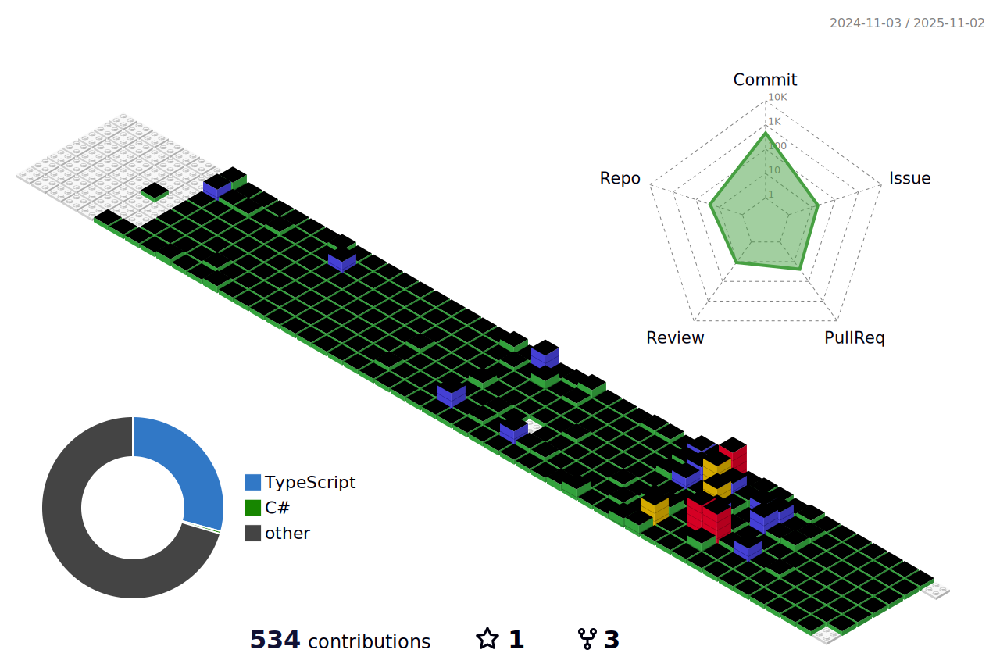

#  Hello, My name is Hyunbin.

  Hi there! 👋 I am a developer specializing in <b>Windows application</b> and <b>Web Front-end development</b>. 
  I have 5 years of experience in Windows application development and 1 year of experience in web development. 
While I am capable of developing for both Android and iOS,  I have recently become interested in using React Native for cross-platform development.  

I am a developer who loves music, enjoys taking on new challenges, and hopes to make the world a better place through code. 🎵✨

## 🔎 You can find me on : 

<a href="https://velog.io/@devbin/posts/" target="_blank">
<a href="https://www.linkedin.com/in/hyunbin-cha-1320801a8" target="_blank">
<a href="mailto:chb6734@gmail.com" target="_blank">
  <a href="https://www.instagram.com/hyunbin_144/" target="_blank">

## Personal stats:

  
Highlights / Proficiencies 

  Highlights :
   - 	⭐ Managed 9 hospital’s Department of Laboratory Medicine Windows application projects for 5 years for 5 years (main developer and interim project manager).
   - 	⭐ Participated as the main frontend developer in creating a sales management web application.
   - 	⭐ Contributed to developing a mock-up application for presentations using React Native.

Proficiencies :
 - 📚 C#, VB.NET, Delphi, Java
 - 📚 React.js, Vanilla JS, Next.js
 - 📚 Oracle, MSSQL, MySQL, DB2
 - 📚 AWS, Firebase

## 🥇 Primary technology stack  
     

-------

